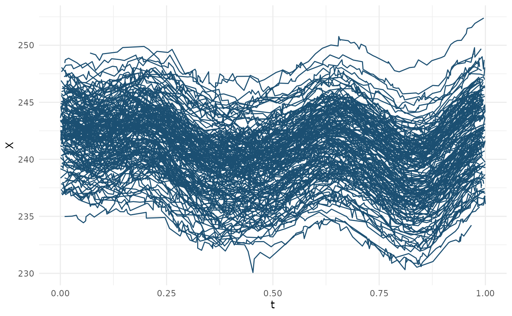

# adaptiveFTS

The vignette proposes an overview on how to perform the adaptive
estimation procedure of mean and the covariance functions estimation as
well as the adaptive prediction of the unobserved part of a curve using
the Best Linear Unbiased Estimator (BLUP). One can refer to the
following references for more ddetails.

1.  **Hassan Maissoro, Valentin Patilea, and Myriam Vimond.** *Adaptive
    Estimation for Weakly Dependent Functional Time Series.* 2024.
    Available at [arXiv:2403.13706](https://arxiv.org/abs/2403.13706).

2.  **Hassan Maissoro, Valentin Patilea, and Myriam Vimond.** *Adaptive
    prediction for Functional Times Series.* 2024. [Work in
    progress](https://hassan.maissoro.com/assets/pdf/2024-adaptive-estimation-for-functional-time-series.pdf).

## The data

The unit of observation is a curve. The data is a collection of $`N`$
curves $`\{X_1, \ldots, X_N\}`$ that are realizations of a process
$`X`$. For each $`1\leq n \leq N`$, the trajectory (or curve) $`X_n`$ is
observed at the domain points
$`\{T_{n,i}, 1\leq i \leq  M_n\}\subset I`$, with additive noise. The
data points associated with $`X_n`$ consist of the pairs \$(Y\_{n,i} ,
T\_{n,i} ) R I $`, where`$\$ Y\_{n,i} = X_n(T\_{n,i}) +
(T\_{n,i})\_{n,i}, n N, ; ; 1i M_n. \$\$ The data generating process
satisfies the following assumptions.

- The series$`\{X_n\}`$ is a (strictly) stationary $`\mathcal H-`$valued
  series.

- The $`M_1, \dotsc, M_N`$ are random draws of an integer variable
  $`M\geq 2`$, with expectation $`\lambda`$.

- Either all the $`T_{n,i}`$ are independent copies of a variable
  $`T\in I`$ which admits a strictly positive density $`g`$ over $`I`$
  (independent design case), or the $`T_{n,i}`$,
  $`1\leq i \leq \lambda=M_n`$, are the points of the same equidistant
  grid of $`\lambda`$ points in $`I`$ (common design case).

- The \$\_{n,i} \$ are independent copies of a centered error variable
  \$\e\$ with unit variance, and $`\sigma^2(\cdot)`$ is a Lipschitz
  continuous function.

- The series $`\{X_n\}`$ and the copies of $`M`$, $`T`$ and
  $`\varepsilon`$ are mutually independent.

The package includes an example of dataset `data_far` drawn as a sample
of an Functional Autoreressive Process of order one (FAR(1)). Thus, in
the following, we first describe how to generate data from a FRA(1).
Second, we explain the data

## Sample of FTS generation

**TODO:** Describe the procedure

## Estimation of local regularity parameters

To estimate the local regularity parameters, call the function
`estimate_locreg`.

    #>        t  locreg_bw     Delta Nused        Ht       Lt
    #>    <num>      <num>     <num> <num>     <num>    <num>
    #> 1:   0.1 0.01740629 0.1923983   105 0.3861327 3.839216
    #> 2:   0.2 0.01740629 0.1923983   118 0.5645557 9.870244
    #> 3:   0.3 0.01740629 0.1923983   118 0.3291596 3.032601
    #> 4:   0.4 0.01740629 0.1923983   115 0.3879541 4.542481
    #> 5:   0.5 0.01740629 0.1923983   122 0.6187842 8.051270
    #> 6:   0.6 0.01740629 0.1923983   117 0.7724431 9.991425
    #> 7:   0.7 0.01740629 0.1923983   119 0.4530097 3.022983
    #> 8:   0.8 0.01740629 0.1923983   127 0.4184367 2.174434
    #> 9:   0.9 0.01740629 0.1923983   111 0.4063427 2.204504

## Estimation of the mean function

## Estimation of the autocovariance function

### Using on bandwidth

### Using two bandwidth

## Adaptive prediction of a curve
