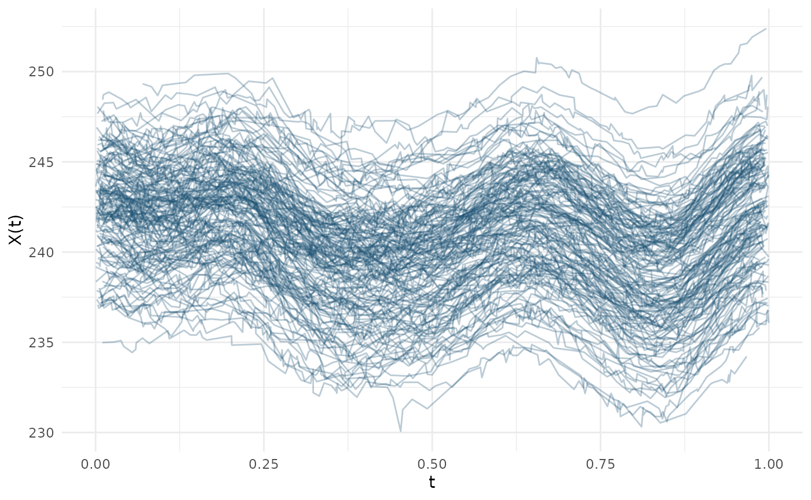
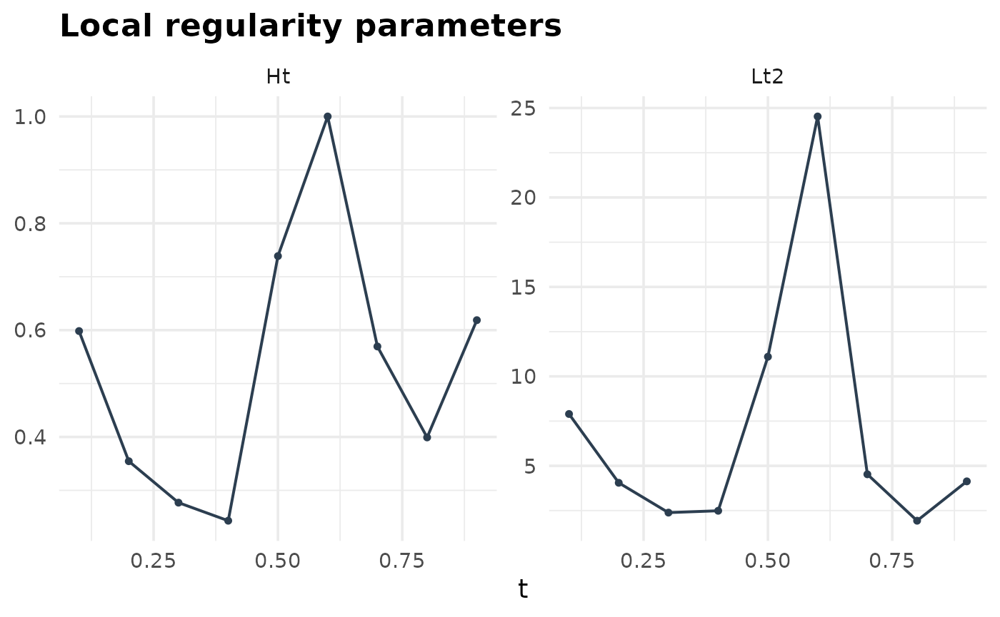
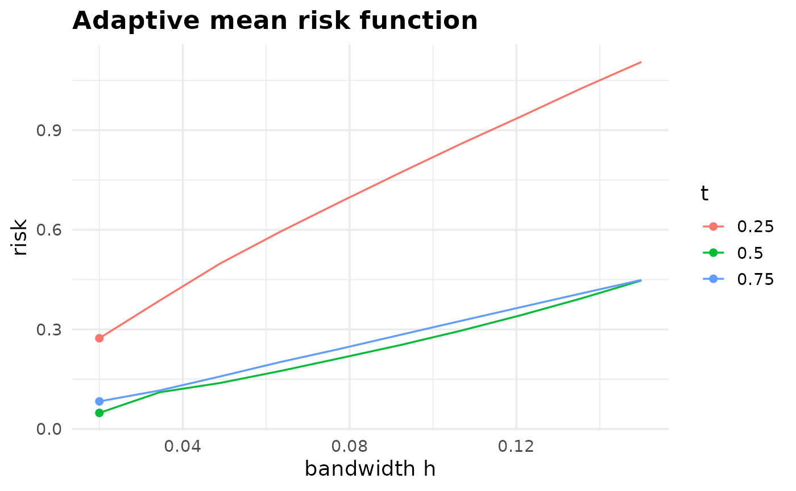
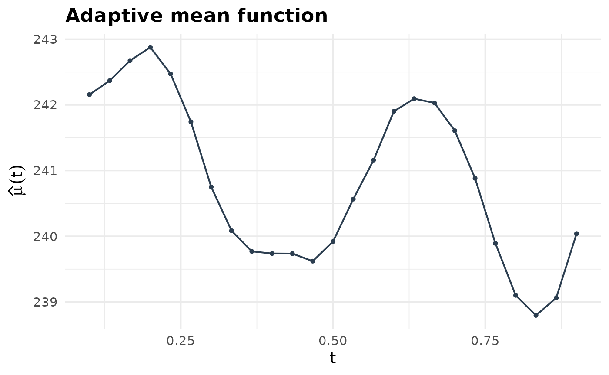
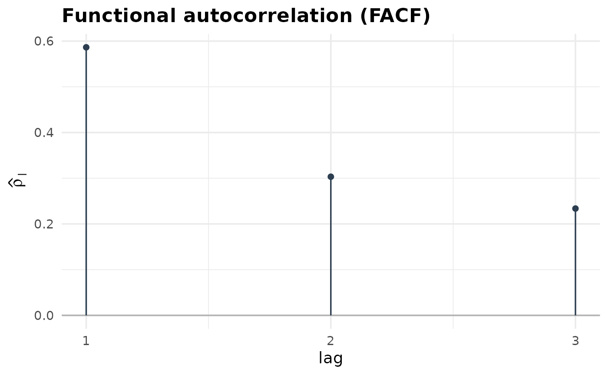
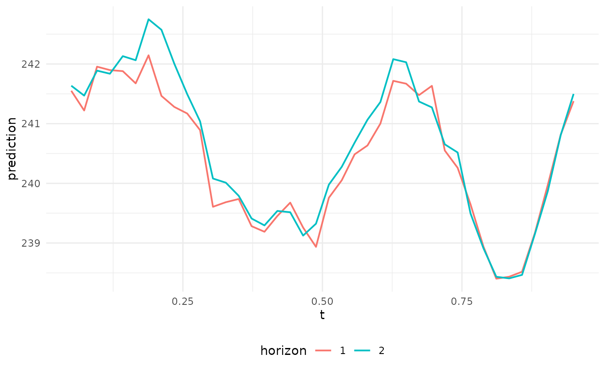

# adaptiveFTS

``` r

library(adaptiveFTS)
library(data.table)
library(ggplot2)
```

This vignette gives an overview of the adaptive estimation of the mean
and the (auto)covariance functions, and of the adaptive prediction of a
curve by the Best Linear Unbiased Predictor (BLUP). See the following
references for the methodology.

1.  **Hassan Maissoro, Valentin Patilea, and Myriam Vimond.** *Adaptive
    Estimation for Weakly Dependent Functional Time Series.* Journal of
    Time Series Analysis, 2025.
    [doi:10.1111/jtsa.70006](https://doi.org/10.1111/jtsa.70006).

2.  **Hassan Maissoro, Valentin Patilea, and Myriam Vimond.** *Adaptive
    Prediction for Functional Time Series.* 2026. arXiv:2609.xxxxx.

## The data

The unit of observation is a curve. The data is a collection of $`N`$
curves $`\{X_1, \ldots, X_N\}`$ that are realizations of a process
$`X`$. For each $`1\leq n \leq N`$, the trajectory (or curve) $`X_n`$ is
observed at the domain points
$`\{T_{n,i}, 1\leq i \leq  M_n\}\subset I`$, with additive noise. The
data points associated with $`X_n`$ consist of the pairs \$(Y\_{n,i} ,
T\_{n,i} ) R I $`, where`$\$ Y\_{n,i} = X_n(T\_{n,i}) +
(T\_{n,i})\_{n,i}, n N, ; ; 1i M_n. \$\$ The data generating process
satisfies the following assumptions.

- The series $`\{X_n\}`$ is a (strictly) stationary
  $`\mathcal H-`$valued series.

- The $`M_1, \dotsc, M_N`$ are random draws of an integer variable
  $`M\geq 2`$, with expectation $`\lambda`$.

- Either all the $`T_{n,i}`$ are independent copies of a variable
  $`T\in I`$ which admits a strictly positive density $`g`$ over $`I`$
  (independent design case), or the $`T_{n,i}`$,
  $`1\leq i \leq \lambda=M_n`$, are the points of the same equidistant
  grid of $`\lambda`$ points in $`I`$ (common design case).

- The $`\varepsilon_{n,i}`$ are independent copies of a centered error
  variable $`\varepsilon`$ with unit variance, and $`\sigma^2(\cdot)`$
  is a Lipschitz continuous function.

- The series $`\{X_n\}`$ and the copies of $`M`$, $`T`$ and
  $`\varepsilon`$ are mutually independent.

Every estimator takes the data through
[`format_data()`](https://hmaissoro.github.io/adaptiveFTS/reference/format_data.md),
which reshapes it into a `data.table` with three columns: `id_curve`,
`tobs` and `X`. The curve index defines the order of the series, so the
curves must be given in chronological order. The domain is
$`I = [0, 1]`$.

The package ships `data_far`, a sample drawn from a functional
autoregressive process of order one, FAR(1).

## Sample of FTS generation

[`simulate_far()`](https://hmaissoro.github.io/adaptiveFTS/reference/simulate_far.md)
draws a FAR(1) sample. The curves are built on an integration grid of
`n_int_grid` points, then observed at `M_distribution` random points per
curve drawn from `t_distribution` (independent design) or at the common
grid `t_common` (common design). The roughness of the sample paths is
set by the Hurst function `hurst_fun` and the squared Hölder constant
`L2`, and the first `n_burnin` curves are dropped so that the returned
sample is close to stationary.

``` r

set.seed(42)
dt_sim <- simulate_far(
  N = 50L, lambda = 40L,
  design = "random",
  M_distribution = rpois,
  t_distribution = runif,
  t_common = NULL,
  hurst_fun = hurst_logistic,
  L2 = 4,
  far_kernel = function(s, t) 9 / 4 * exp(-(t + 2 * s) ** 2),
  far_mean = function(t) 4 * sin(1.5 * pi * t),
  n_int_grid = 100L,
  n_burnin = 100L,
  remove_burnin = TRUE)

head(dt_sim)
#>    id_curve        tobs    ttag   far_mean         X
#>       <int>       <num>  <char>      <num>     <num>
#> 1:        1 0.002338519 trandom 0.04407915 0.7264436
#> 2:        1 0.031619531 trandom 0.59381111 3.3791868
#> 3:        1 0.037706318 trandom 0.70701322 3.7074432
#> 4:        1 0.103313245 trandom 1.87138461 3.7353709
#> 5:        1 0.118140133 trandom 2.11362507 5.9565695
#> 6:        1 0.123435143 trandom 2.19769500 6.2219460
```

The packaged `data_far` was drawn the same way. Its curves look like
this.

``` r

data("data_far")

ggplot(data = data_far[, list("id_curve" = as.factor(id_curve), "t" = tobs, X)],
       mapping = aes(x = t, y = X, group = id_curve)) +
  geom_line(colour = "#1B4F72", alpha = 0.3) +
  labs(x = "t", y = "X(t)") +
  theme_minimal()
```



The estimation sections below run on the first 60 curves, to keep this
vignette quick to build.

``` r

dt_sub <- data_far[id_curve <= 60]
```

## Estimation of local regularity parameters

[`estimate_locreg()`](https://hmaissoro.github.io/adaptiveFTS/reference/estimate_locreg.md)
estimates the local Hölder exponent $`H_t`$ and the squared Hölder
constant $`L_t^2`$ at each point of `t`. Together they drive the
bandwidth chosen by every estimator below: the rougher the process at
$`t`$, the smaller the bandwidth.

``` r

t0 <- seq(0.1, 0.9, len = 9)

dt_locreg <- estimate_locreg(data = dt_sub,
                             idcol = "id_curve",
                             tcol = "tobs",
                             ycol = "X",
                             t = t0,
                             Delta = NULL,
                             presmooth_bw = NULL,
                             kernel_name = "epanechnikov",
                             center = TRUE)

dt_locreg
#>        t locreg_bw    Delta Nused        Ht       Lt2
#>    <num>     <num>    <num> <num>     <num>     <num>
#> 1:   0.1 0.0155714 0.192132    43 0.5982658  7.897670
#> 2:   0.2 0.0155714 0.192132    49 0.3545932  4.051798
#> 3:   0.3 0.0155714 0.192132    47 0.2769889  2.385011
#> 4:   0.4 0.0155714 0.192132    46 0.2431588  2.487977
#> 5:   0.5 0.0155714 0.192132    48 0.7386256 11.097135
#> 6:   0.6 0.0155714 0.192132    39 1.0000000 24.526444
#> 7:   0.7 0.0155714 0.192132    48 0.5694092  4.526377
#> 8:   0.8 0.0155714 0.192132    48 0.3991194  1.931887
#> 9:   0.9 0.0155714 0.192132    43 0.6186443  4.131826
```

Every estimator output carries
[`summary()`](https://rdrr.io/r/base/summary.html) and
[`plot()`](https://rdrr.io/r/graphics/plot.default.html) methods.

``` r

summary(dt_locreg)
#> Adaptive local regularity estimates
#>   Evaluation points  : 9 (t in [0.1, 0.9])
#>   Kernel             : epanechnikov (centred: TRUE)
#>   Delta              : 0.1921
#>   Curves used (Nused): [39, 49]
#>   Ht                 : [0.243, 1]
#>   Lt2                : [1.93, 24.5]
plot(dt_locreg)
```



## Estimation of the mean function

The adaptive mean estimator selects its bandwidth point by point, by
minimising the estimated risk over a grid of candidates.
[`estimate_mean_risk()`](https://hmaissoro.github.io/adaptiveFTS/reference/estimate_mean_risk.md)
exposes that risk, split into its bias, variance and dependence terms.

``` r

bw_grid <- seq(0.02, 0.15, length.out = 10)

dt_mean_risk <- estimate_mean_risk(
  data = dt_sub, idcol = "id_curve", tcol = "tobs", ycol = "X",
  t = c(1/4, 1/2, 3/4), bw_grid = bw_grid, kernel_name = "epanechnikov")

plot(dt_mean_risk)
```



[`estimate_mean()`](https://hmaissoro.github.io/adaptiveFTS/reference/estimate_mean.md)
runs the same selection and returns the estimate, reporting the
bandwidth used at each point in the `optbw` column.

``` r

dt_mean <- estimate_mean(
  data = dt_sub, idcol = "id_curve", tcol = "tobs", ycol = "X",
  t = seq(0.1, 0.9, length.out = 25), bw_grid = bw_grid,
  kernel_name = "epanechnikov")

summary(dt_mean)
#> Adaptive mean function estimate
#>   Evaluation points  : 25 (t in [0.1, 0.9])
#>   Training curves    : 60
#>   Kernel             : epanechnikov
#>   Optimal bandwidth  : [0.02, 0.02]
#>   Curves used (PN)   : [55, 60]
#>   muhat              : [239, 243]
plot(dt_mean)
```



## Estimation of the autocovariance function

The lag-$`\ell`$ autocovariance is estimated at pairs of points
$`(s, t)`$. Two estimators are available, selected by `common_bw`.

### Using one bandwidth

With `common_bw = TRUE` a single bandwidth is selected for both
arguments. This is the estimator of Maissoro, Patilea and Vimond (2025).

``` r

sgrid <- c(1/5, 2/5, 3/5, 4/5)
tgrid <- c(1/4, 1/2, 3/5, 3/4)

dt_autocov_1bw <- estimate_autocov(
  data = dt_sub, idcol = "id_curve", tcol = "tobs", ycol = "X",
  s = sgrid, t = tgrid, lag = 1, bw_grid = bw_grid,
  common_bw = TRUE, center_curves = TRUE, correct_diagonal = FALSE,
  kernel_name = "epanechnikov")

dt_autocov_1bw[, list(s, t, optbw_s, optbw_t, autocov)]
#>        s     t    optbw_s    optbw_t  autocov
#>    <num> <num>      <num>      <num>    <num>
#> 1:   0.2  0.25 0.02000000 0.02000000 7.458938
#> 2:   0.4  0.50 0.02000000 0.02000000 6.759217
#> 3:   0.6  0.60 0.02000000 0.02000000 5.369041
#> 4:   0.8  0.75 0.03444444 0.03444444 5.115933
```

### Using two bandwidths

With `common_bw = FALSE` the risk is minimised over pairs
$`(h_s, h_t)`$, so the estimator adapts to the regularity at $`s`$ and
at $`t`$ separately. This is the estimator of Maissoro, Patilea and
Vimond (2026). It explores the square of the grid and therefore costs
noticeably more.

``` r

dt_autocov_2bw <- estimate_autocov(
  data = dt_sub, idcol = "id_curve", tcol = "tobs", ycol = "X",
  s = sgrid, t = tgrid, lag = 1, bw_grid = bw_grid,
  common_bw = FALSE, center_curves = TRUE, correct_diagonal = FALSE,
  kernel_name = "epanechnikov")

dt_autocov_2bw[, list(s, t, optbw_s, optbw_t, autocov)]
#>        s     t optbw_s    optbw_t  autocov
#>    <num> <num>   <num>      <num>    <num>
#> 1:   0.2  0.25    0.02 0.02000000 7.458938
#> 2:   0.4  0.50    0.02 0.02000000 6.759217
#> 3:   0.6  0.60    0.02 0.02000000 5.369041
#> 4:   0.8  0.75    0.02 0.03444444 5.168580
```

The two bandwidths differ wherever the estimated regularity differs
between $`s`$ and $`t`$.

### Functional autocorrelation

[`estimate_facf()`](https://hmaissoro.github.io/adaptiveFTS/reference/estimate_facf.md)
normalises the lag-$`\ell`$ autocovariance surfaces into a functional
analogue of the autocorrelation function of a scalar series, which is a
convenient way to read the serial dependence of the sample.

``` r

dt_facf <- estimate_facf(
  data = dt_sub, idcol = "id_curve", tcol = "tobs", ycol = "X",
  lag.max = 3, n_grid = 8, bw_grid = bw_grid, common_bw = TRUE,
  kernel_name = "epanechnikov")

summary(dt_facf)
#> Functional autocorrelation function (FACF)
#>   Design             : independent
#>   Evaluation grid    : 8 points
#>   Training curves    : 60
#>   Kernel             : epanechnikov
#>   Lags               : 1 to 3
#>   rho                : [0.234, 0.586]
#>   Largest |rho|      : 0.5864 (lag 1)
plot(dt_facf)
```



## Adaptive prediction of a curve

[`blup_fit()`](https://hmaissoro.github.io/adaptiveFTS/reference/blup_fit.md)
estimates every component of the adaptive BLUP that does not depend on
the prediction points, and
[`predict()`](https://rdrr.io/r/stats/predict.html) evaluates the
predictor on a grid. The Tikhonov regularisation parameter is selected
by cross-validation when left to `NULL`.

``` r

data_train <- format_data(dt_sub, idcol = "id_curve", tcol = "tobs", ycol = "X")

fit <- blup_fit(data = data_train, n_cv_curves = 10L)
summary(fit)
#> Adaptive functional BLUP fit
#>   Design             : independent
#>   Training curves    : 60
#>   Conditioning curve : id 60, M = 86 points
#>   Kernel             : epanechnikov (homoscedastic)
#>   Noise variance     : 0.1257
#>   Tikhonov           : 0.5134 (CV-selected, min CV =  6.56)
```

[`predict()`](https://rdrr.io/r/stats/predict.html) reconstructs the
curve following the conditioning one. With `horizon > 1`, each
intermediate curve is fed back as the new conditioning curve and every
intermediate prediction is returned.

``` r

dt_pred <- predict(fit, t = seq(0.05, 0.95, length.out = 40), horizon = 2L)

ggplot(dt_pred, aes(x = t, y = prediction, colour = factor(horizon))) +
  geom_line(linewidth = 0.7) +
  labs(x = "t", y = "prediction", colour = "horizon") +
  theme_minimal() +
  theme(legend.position = "bottom")
```


